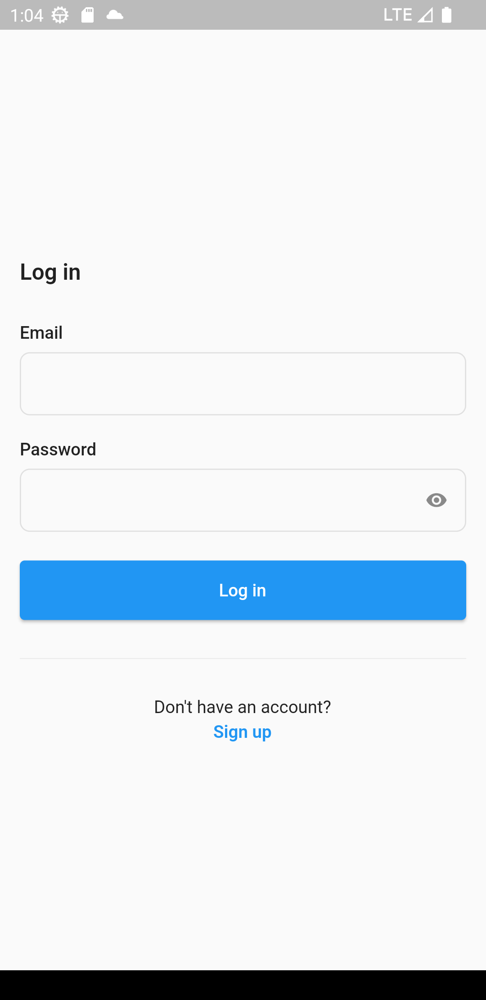
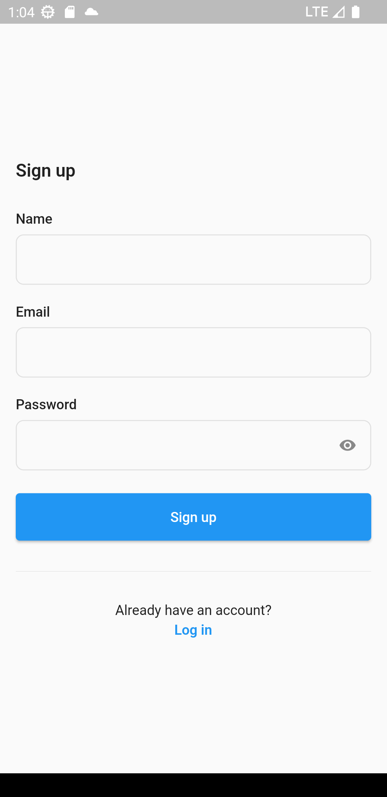
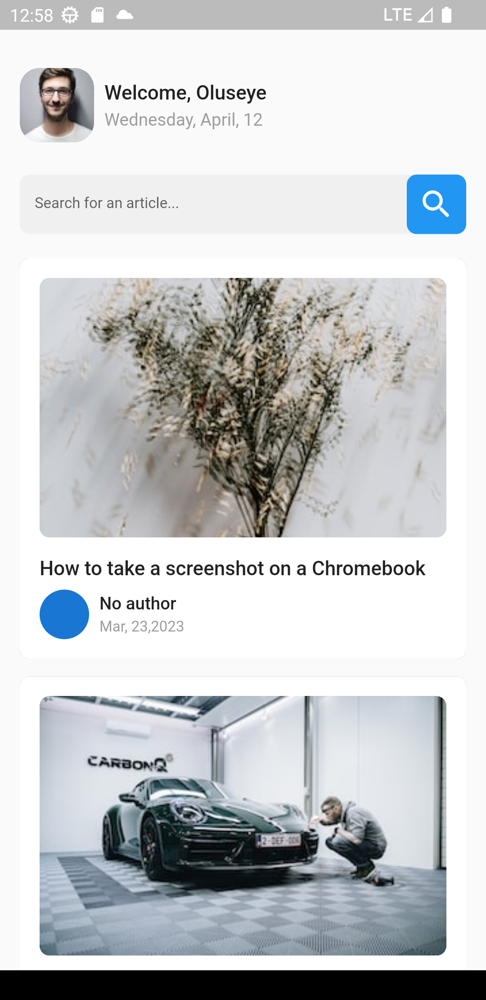
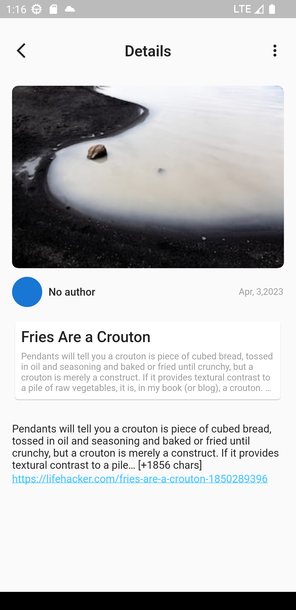

## News App

This is an application that allows user to sign up and login with email and password using Firebase as backend. Genereates articles from [News Api](https://newsapi.org/) then store them in Cloud Firestore.

You can get more details by clicking on each article and more on the article by clicking on the url in the Details page.

# Login

# Signup

# Home

# Full Details 

